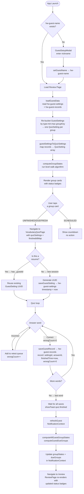
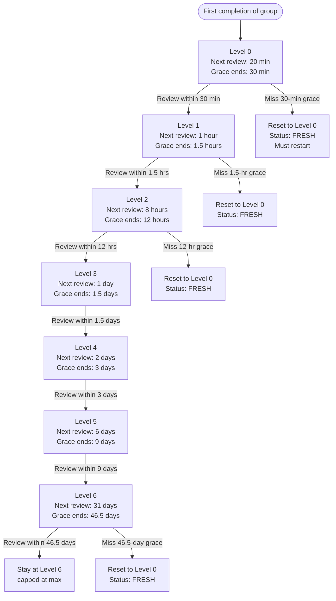
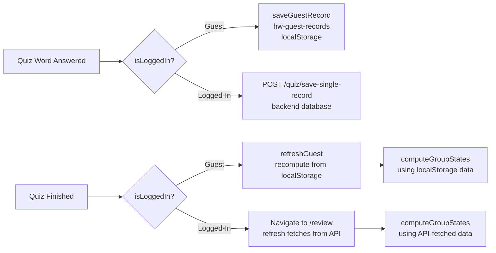
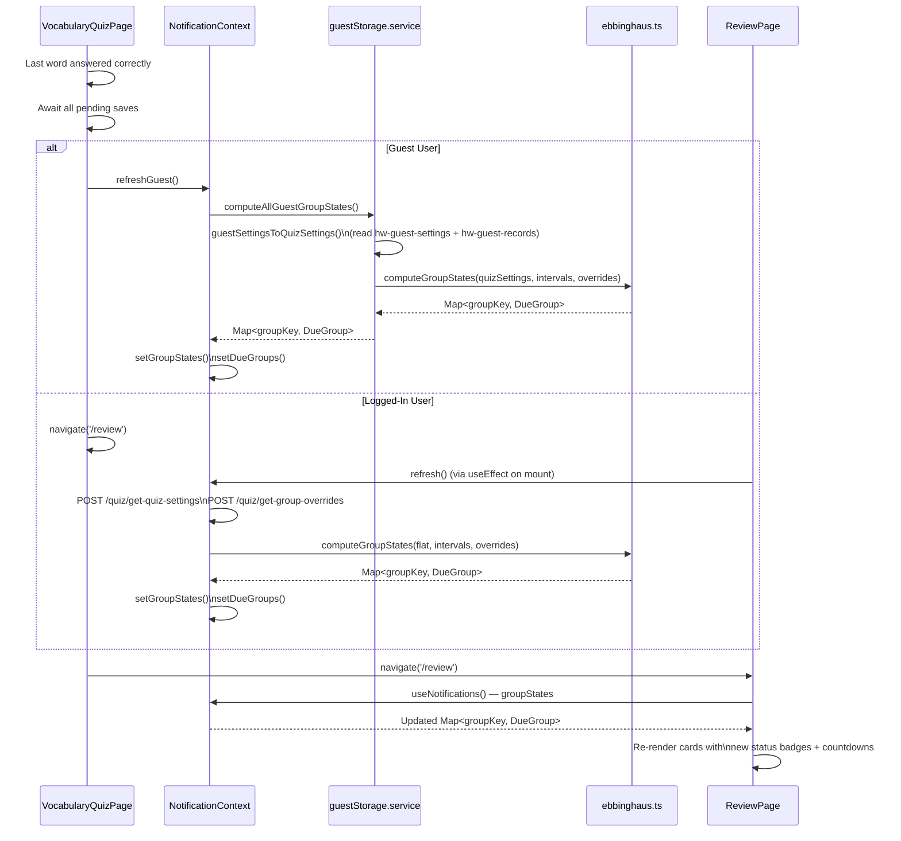
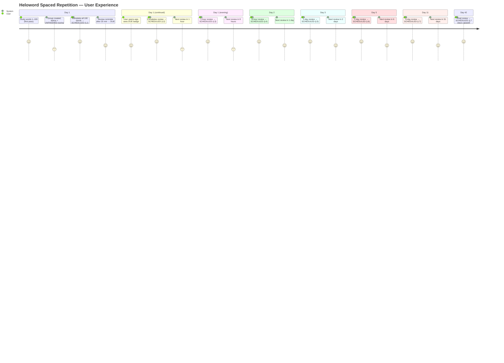

# Heloword — Forgetting Curve Review System

This document describes the spaced-repetition engine that drives the Review feature. It covers the algorithm, state machine, data storage model, and end-to-end flows for both guest and logged-in users.

---

## Table of Contents

1. [Core Concept](#1-core-concept)
2. [Review Schedule (Intervals)](#2-review-schedule-intervals)
3. [Group Identity](#3-group-identity)
4. [Review States](#4-review-states)
5. [Grace Window](#5-grace-window)
6. [Level Walk Algorithm](#6-level-walk-algorithm)
7. [State Determination Logic](#7-state-determination-logic)
8. [Manual Level Override](#8-manual-level-override)
9. [Data Storage Model](#9-data-storage-model)
10. [Guest User Flow](#10-guest-user-flow)
11. [Logged-In User Flow](#11-logged-in-user-flow)
12. [Signal Chain — Quiz Completion → Review Update](#12-signal-chain--quiz-completion--review-update)
13. [Edge Cases & Constraints](#13-edge-cases--constraints)
14. [UI Rendering Contract](#14-ui-rendering-contract)
15. [User Experience Journey](#15-user-experience-journey)

---

## 1. Core Concept

Heloword implements the **Ebbinghaus Forgetting Curve**: memory retention decays over time, but is reinforced each time you successfully review material. Each reinforcement extends the interval before the next review is needed.

A **word group** is a range of words of a specific type (e.g. English words 1–1000). Every time the user completes a full quiz on that group on schedule, the group advances to the next review level, doubling (roughly) the wait time before the next review. If the user misses the review window, the group resets to level 0.

---

## 2. Review Schedule (Intervals)

There are **7 review levels** (indices 0–6). The default schedule is:

| Level | Interval | Notes                            |
|-------|----------|----------------------------------|
| 0     | 20 min   | First review after initial pass  |
| 1     | 1 hour   |                                  |
| 2     | 8 hours  |                                  |
| 3     | 1 day    |                                  |
| 4     | 2 days   |                                  |
| 5     | 6 days   |                                  |
| 6     | 31 days  | Maximum interval (level is capped here) |

These are stored in `DEFAULT_INTERVALS_MS` in `src/utils/ebbinghaus.ts`.
Users can customise them; custom values are persisted in localStorage under the key `hw-review-intervals`.

---

## 3. Group Identity

A **group** is uniquely identified by a composite key:

```
groupKey = "<type>:<min>:<max>"

Examples:
  wordEnglishList:1:1000
  wordJapaneseList:1:500
  wordEnglishList:2001:4000
```

All quiz sessions for the same `(type, min, max)` range are treated as repeated reviews of the **same group** — even if they were created on different days.

The key is produced/parsed by:
```typescript
// src/utils/ebbinghaus.ts
getGroupKey(type, min, max)  → "type:min:max"
parseGroupKey(key)           → { type, min, max }
```

If `min` or `max` are absent on a `QuizSetting`, the defaults `min=1`, `max=total` are used.

---

## 4. Review States

Each group is in exactly one of four states at any given moment:

| State        | Meaning                                                          | Badge colour |
|--------------|------------------------------------------------------------------|--------------|
| `UNFINISHED` | The most recent quiz session was not fully completed             | Orange       |
| `DUE`        | The review interval has elapsed; review is ready                | Orange       |
| `FRESH`      | The grace window has passed; the group is considered "forgotten" and level resets | Red    |
| `SCHEDULED`  | The next review is not yet due; shows a countdown               | Blue/Grey    |

Only `UNFINISHED`, `DUE`, and `FRESH` groups appear in the notification badge count. `SCHEDULED` groups are shown on the Review page with a countdown timer.

---

## 5. Grace Window

After a review becomes **DUE**, the user has an extra **50% of the current interval** before the system declares the review "forgotten" (`FRESH`).

```
dueTime  = lastCompletionTime + interval
graceEnd = dueTime + interval × 0.5
         = lastCompletionTime + interval × 1.5
```

Example — Level 0 (20 min interval):

```
t=0 min   → Quiz completed (Level 0)
t=20 min  → Review becomes DUE
t=30 min  → Grace window ends → FRESH if not reviewed by now
```

Example — Level 2 (8 hour interval):

```
t=0h   → Quiz completed (Level 2)
t=8h   → Review becomes DUE
t=12h  → Grace window ends → FRESH if not reviewed
```

When a group enters `FRESH`, its effective review level resets to 0 on the next completion. The group must restart the 7-level ladder from scratch.

---

## 6. Level Walk Algorithm

`computeGroupStates()` processes the full chronological history of completed sessions to determine the current effective review level.

**Input:** All `QuizSetting` records for a group, sorted ascending by `latestFinishedTime`.

**Algorithm:**

```
level    = 0
prevTime = completedTimes[0]   ← first completion timestamp

for each subsequent completion at time T:
    interval = intervals[ min(level, 6) ]
    graceEnd = prevTime + interval × 1.5

    if T ≤ graceEnd:
        level = min(level + 1, 6)   ← on time → advance (capped at 6)
    else:
        level = 0                   ← missed window → reset

    prevTime = T
```

After the loop, `level` is the current review level, and `prevTime` is the last completion time.

**Key properties:**

- The level lookup is always capped: `intervals[min(level, 6)]`. Level itself is also capped at 6 to prevent it from exceeding the array.
- Only **fully completed** sessions count: `finishedCount ≥ rangeSize` AND `latestFinishedTime` is set.
- If there are zero completed sessions, the group is immediately `UNFINISHED`.

---

## 7. State Determination Logic

After the level walk, the current status is determined by comparing `Date.now()` against the computed schedule:

```
dueTime  = prevTime + intervals[min(level, 6)]
graceEnd = dueTime  + intervals[min(level, 6)] × 0.5

if mostRecentSession.finishedCount < rangeSize:
    status = UNFINISHED          ← in-progress session takes priority

else if now ≥ graceEnd:
    status = FRESH               ← missed the window

else if now ≥ dueTime:
    status = DUE                 ← review ready

else:
    status = SCHEDULED           ← not yet due
```

The `UNFINISHED` check takes absolute priority over time-based checks — even if the review window has long passed, a partially-done session is shown as `UNFINISHED`.

The `DueGroup` returned contains:

```typescript
{
  groupKey,            // "type:min:max"
  type, min, max,
  status,              // UNFINISHED | DUE | FRESH | SCHEDULED
  reviewLevel,         // 0–6 (effective level based on history)
  nextReviewTime,      // Date — when the review is/was due
  lastCompletionTime,  // Date — when the group was last fully completed
}
```

---

## 8. Manual Level Override

A user (or admin) can manually set the review level for any group. This bypasses the completion history entirely.

```typescript
interface GroupLevelOverride {
  level: number;   // 0–6
  setAt: Date;     // treated as "last completion time"
}
```

When an override is present, the status is derived from `setAt` + `intervals[level]` using the same due/grace logic — no level walk is performed.

**Guest users:** overrides stored in localStorage at `hw-group-level-overrides`
**Logged-in users:** overrides fetched from `/frontend-api/api/fe/quiz/get-group-overrides`

---

## 9. Data Storage Model

### Guest Users — localStorage

| Key                       | Type              | Description                                                     |
|---------------------------|-------------------|-----------------------------------------------------------------|
| `hw-guest-settings`       | `GuestSetting[]`  | One entry per quiz session started. Stores type, min, max, timestamp. |
| `hw-guest-records`        | `GuestRecord[]`   | One entry per **correctly answered** word. Stores settingId, answerId, finishedTime, wrongCount. |
| `hw-group-level-overrides`| JSON object       | Map of `groupKey → { level, setAt }`. Manual overrides.         |
| `hw-review-intervals`     | `number[]`        | Optional custom interval schedule (ms). Falls back to defaults. |
| `hw-guest-name`           | string            | Guest display name (e.g. `Guest-Alice`)                        |
| `hw-guest-id`             | string            | Persistent guest UUID                                           |

**GuestSetting schema:**
```typescript
{
  id: string;          // UUID — links to GuestRecord.settingId
  timestamp: string;   // ISO date — used to group sessions by day on ReviewPage
  type: string;        // e.g. 'wordEnglishList'
  tableName: string;
  min: number;
  max: number;
  total: number;
}
```

**GuestRecord schema:**
```typescript
{
  id: string;
  settingId: string;       // references GuestSetting.id
  answerId: number;        // word ID
  answerTableName: string;
  timeSpent: number;       // seconds on this word
  finishedTime: string;    // ISO date — used as latestFinishedTime
  wrongCount: number;      // 0 = correct, >0 = had errors
  quizIndex: number;
}
```

**Conversion to `QuizSetting[]`:**
`guestSettingsToQuizSettings()` in `guestStorage.service.ts` maps guest records to the shared `QuizSetting` model:
- `finishedCount` = count of unique `answerId`s with `wrongCount === 0` for this session
- `latestFinishedTime` = most recent `finishedTime` among correct records for this session

This allows the same `computeGroupStates()` function to work for both guest and logged-in users.

### Logged-In Users — Backend API

| Endpoint                                         | Method | Purpose                                             |
|--------------------------------------------------|--------|-----------------------------------------------------|
| `/frontend-api/api/fe/quiz/save-setting-records` | POST   | Create quiz session records, returns assigned IDs   |
| `/frontend-api/api/fe/quiz/save-single-record`   | POST   | Save one completed word answer                      |
| `/frontend-api/api/fe/quiz/get-quiz-settings`    | POST   | Fetch all QuizSettings grouped by date              |
| `/frontend-api/api/fe/quiz/get-group-overrides`  | POST   | Fetch manual level overrides for all groups         |

The backend stores settings in a `QuizSettingEntity` table and records in a `QuizRecordEntity` table, both linked by `userId`.

---

## 10. Guest User Flow



### Guest — Level Progression Detail



---

## 11. Logged-In User Flow

```mermaid
flowchart TD
    A([App Launch / Login]) --> B[AuthContext detects\nisLoggedIn = true]
    B --> C[NotificationContext\ncalls refresh]
    C --> D[POST /quiz/get-quiz-settings\nPOST /quiz/get-group-overrides]
    D --> E[Re-bucket all QuizSettings\nby type:min:max groupKey\n(different ranges never merge)]
    E --> F[Build overrides map\ngroupKey → GroupLevelOverride]
    F --> G[computeGroupStates\nallSettings + intervals + overrides]
    G --> H[setGroupStates + setDueGroups\nin NotificationContext]
    H --> I[Nav badge shows\ndueCount]

    I --> J[User opens Review Page]
    J --> K[Read groupStates\nfrom NotificationContext]
    K --> L[Render group cards\nstatus badge + level + countdown]

    L --> M{User taps\na group}
    M -- has id = already persisted --> N[Navigate to VocabularyQuizPage\nquizSettings includes id]
    M -- UNFINISHED no id --> N

    N --> O[saveQuizSettings checks:\nalreadyPersisted? yes → reuse id]
    O --> P[Quiz loop]

    P --> Q{Answer word}
    Q -- Incorrect --> R[Retest queue]
    R --> Q
    Q -- Correct --> S[POST /quiz/save-single-record\nrecordQuizSettingId, answerId,\nfinishedTime, wrongCount=0]
    S --> T{More words?}
    T -- Yes --> Q
    T -- No → last word --> U[Await all pending API saves\nshowToast quiz.finished]

    U --> V[Navigate to /review\nReviewPage mounts / re-renders]
    V --> W[Review page refresh:\ncall refresh in useEffect\nor user manually refreshes]
    W --> X[POST /quiz/get-quiz-settings\nfetch updated settings]
    X --> Y[computeGroupStates recomputes\nnew level + status for completed group]
    Y --> Z[Group card shows updated\nstatus + new countdown]
```

### Logged-In — Key Difference from Guest



---

## 12. Signal Chain — Quiz Completion → Review Update



---

## 13. Edge Cases & Constraints

### Level cap at 6
The level is capped at `intervals.length - 1` = **6**. Once a group reaches level 6, on-time reviews keep it at level 6 permanently (interval stays at 31 days). Missed grace at level 6 resets to 0.

```typescript
level = onTime ? Math.min(level + 1, intervals.length - 1) : 0;
```

### UNFINISHED takes priority
If the most recent session's `finishedCount < rangeSize`, the group is `UNFINISHED` regardless of how much time has passed. This prevents a partially-done session from expiring to `DUE` or `FRESH`.

### Duplicate sessions (same timestamps)
If two settings for the same group have identical `latestFinishedTime`, both appear in `completedTimes`. The second one will be within the grace window of the first (0ms elapsed ≪ 30min grace), so level advances by 1. This is an edge case that only arises from duplicate data.

### Custom range size
Range size is computed as `max - min + 1`, not from the `total` field. This ensures custom-range quizzes (e.g. words 51–100 from a 1000-word list) can complete properly. `total` reflects the full list size, not the selected range.

### Group identity across days
Settings on **different days for the same range** belong to the **same group**. The level walk processes all of them chronologically, so session history spans multiple days correctly.

### Grace window miss triggers FRESH on next *status check*, not on next *completion*
`FRESH` status is shown when `now ≥ graceEnd` at render time. The level itself only resets to 0 during the level walk when the user actually completes the group again (a new `latestFinishedTime` is added that falls past the prior `graceEnd`). So `reviewLevel` in a `FRESH` DueGroup reflects the level the user had reached before forgetting — not 0.

### Offline / localStorage data persistence
For guest users, all quiz data lives in localStorage. Clearing browser storage erases all history and resets all groups. There is no sync to a backend for guest users.

### Manual override supersedes history
When an override exists for a group key, the entire level walk is skipped. The override's `setAt` is used as the effective last completion time and `level` is taken verbatim. Overrides are not automatically cleared; they must be explicitly deleted.

---

## 14. UI Rendering Contract

This section documents exactly what a user sees for each review state. It serves as the spec for component tests.

### Card-level rendering

| State        | Status badge (SPAN) | Action prompt              | "Review early" button | Next-review countdown | Progress bar              | Completion ratio |
|--------------|---------------------|----------------------------|-----------------------|-----------------------|---------------------------|------------------|
| `UNFINISHED` | `UNFINISHED` (orange)| `review.resumePrompt`      | No                    | No                    | `cycleCompleted % total`  | `n/total`        |
| `DUE`        | `DUE` (orange)      | `review.reviewNow`         | No                    | No                    | `0%` (new cycle)          | `0/total`        |
| `FRESH`      | `FRESH` (red)       | `review.reviewNow`         | No                    | No                    | `0%` (new cycle)          | `0/total`        |
| `SCHEDULED`  | `SCHEDULED` (blue)  | _(none)_                   | Yes (when 100%)       | Yes (`review.nextReview`) | `100%`               | `total/total`    |

> **Progress bar logic:** `cycleCompleted = completedCount % rangeSize`. For a completed cycle (completedCount = rangeSize), this is 0 — starting a new cycle. SCHEDULED groups explicitly display `total` (not `cycleCompleted`) to show 100%.

### Level display

| `reviewLevel` | Badge text | Interval label |
|---------------|-----------|----------------|
| 0             | `L1`      | 20 min         |
| 1             | `L2`      | 1 hour         |
| 2             | `L3`      | 8 hours        |
| 3             | `L4`      | 1 day          |
| 4             | `L5`      | 2 days         |
| 5             | `L6`      | 6 days         |
| 6             | `L7`      | 31 days        |

> `reviewLevel` is 0-indexed (the array index). The UI displays `reviewLevel + 1` as "Level N" so that users see L1–L7, not L0–L6.

### Due-for-review banner

Shown when `dueCount > 0` (i.e. at least one UNFINISHED, DUE, or FRESH group exists).

| Element                  | Content                                                         |
|--------------------------|-----------------------------------------------------------------|
| Count badge              | `dueCount` (number, orange circle)                             |
| Description              | `review.dueDescription`                                         |
| Group chips              | One chip per due group: `{t(wordListKey)} {min}–{max} L{reviewLevel}` |
| "Start Due Review" button| `review.startDueReview` — starts all due groups in sequence    |

> When there are more than 6 due groups, only the first 6 chips are shown and a "N more" label appears.

### Filter bar

Always rendered when at least one group card exists. Buttons: **All**, **DUE**, **FRESH**, **UNFINISHED**, **SCHEDULED**. Tapping a filter hides cards not matching that state.

### Guest upsell banner

Shown for non-logged-in users at the top of the Review page, above all group cards. Contains `review.guestBanner` text and a `common.login` link `<span>`.

---

## 15. User Experience Journey

The following shows the full lifecycle a user experiences from first study to long-term retention:



### What the user sees at each transition

```
Day 1 (t=0)    ┌─────────────────────────────────────────────────────┐
                │  [ wordEnglishList (1–100) ]           UNFINISHED   │
                │  ████████░░░░░░░░░░░░  50/100   L1 · 20 min        │
                │  Continue where you left off →                      │
                └─────────────────────────────────────────────────────┘

Day 1 (t=20m)  ┌─────────────────────────────────────────────────────┐
                │  ⚠ 1 group due for review    [Start Due Review]     │
                │                                                      │
                │  [ wordEnglishList (1–100) ]               DUE      │
                │  ░░░░░░░░░░░░░░░░░░░░  0/100    L1 · 20 min        │
                │  Review Now →                                        │
                └─────────────────────────────────────────────────────┘

Day 1 (t=30m)  ┌─────────────────────────────────────────────────────┐
                │  ⚠ 1 group due for review    [Start Due Review]     │
                │                                                      │
                │  [ wordEnglishList (1–100) ]             FRESH      │
                │  ░░░░░░░░░░░░░░░░░░░░  0/100    L1 · 20 min        │
                │  Review Now (level resets on completion) →           │
                └─────────────────────────────────────────────────────┘

Day 1 (after   ┌─────────────────────────────────────────────────────┐
review done)    │  [ wordEnglishList (1–100) ]           SCHEDULED    │
                │  ████████████████████  100/100  L2 · 1 hour        │
                │  Next review: in 1 hour     [Review Early →]        │
                └─────────────────────────────────────────────────────┘
```

### Forgetting curve visualised

```
Retention
  100% ─┐ Review         Review       Review        Review
        │  ╲               ╲            ╲              ╲
   60%  │   ╲─────(DUE)     ╲──────(DUE) ╲────────(DUE) ╲ ...
        │         ╲               ╲             ╲
   30%  │          ╲(FRESH)        ╲(FRESH)      ╲(FRESH)
        │
    0%  └──────────────────────────────────────────────────▶ Time
              20m    30m   1h  1.5h  8h   12h   1d  1.5d
              └─ L0 ─┘    └── L1 ──┘    └─── L2 ──┘
```

Each review must happen inside the **DUE window** (between `dueTime` and `graceEnd`) to advance the level. Reviewing too early (before `dueTime`) does not advance the level — only the SCHEDULED → DUE transition triggers the next level increment on the subsequent completion.
